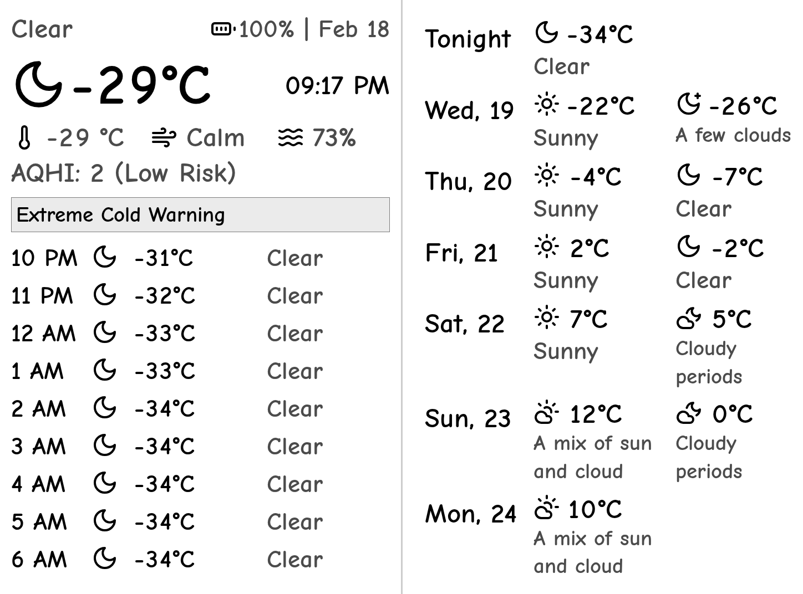

# Kindle Weather Dashboard (for PaperWhite 7th Gen)

Hey there! 👋 This is a fun little project I put together to display weather info on my Kindle. It's specifically built to work with Environment Canada's weather data (because their API is free and pretty decent!).

This is the server that I'm using for the Kindle Dashboard specified in this blog post: 
[Reviving my Kindle PW7](https://terminalbytes.com/reviving-kindle-paperwhite-7th-gen/)



*👆 This is how it looks on my Kindle! (Rotated 90° for Kindle display)*

## What's This All About?

This dashboard generates a clean, Kindle-friendly weather display that shows:
- Current temperature and conditions
- Feels like temperature
- Wind speed and humidity
- Air Quality Health Index (AQHI)
- Hourly forecast
- Daily forecast (day/night split)
- Battery level of your Kindle
- Weather alerts (when active)

## ⚠️ Project Status

Look, this is a pretty rough project that I hacked together for my own use. It works for me, but there might be bugs, and the code could definitely use some cleanup. That said, if you're in Canada and want to build your own Kindle weather display, this could be a good starting point!

## 🛠️ Tech Stack

- **Backend**: Node.js with TypeScript
- **Web Framework**: Express
- **Image Processing**: 
  - Playwright (for capturing the HTML dashboard)
  - Sharp (for image processing and Kindle-friendly conversion)
- **Weather Data**: Environment Canada API (not sure if you're allowed to use it for this purpose, so use at your own risk)
- **Icons**: Lucide icons (for consistent, clean weather icons)
- **Containerization**: Docker & Docker Compose

## 🎨 Cool Features

- **Responsive Design**: The dashboard is built with CSS Grid and Flexbox
- **Dynamic Sizing**: Text automatically scales based on content length
- **Kindle Optimization**: Images are converted to B&W and rotated for Kindle display
- **Icon Mapping**: Includes a comprehensive mapping of Environment Canada weather codes to Lucide icons
- **Battery Display**: Shows your Kindle's battery level with appropriate icons

## 🚀 Getting Started

### Prerequisites

- Docker
- Docker Compose
- A thirst for weather data 🌤️

### Quick Start

1. Grab the code:
```bash
git clone git@github.com:terminalbytes/kindle-dashboard.git
cd kindle-dashboard
```
2. Modify the location LAT/LONG in the `api-weather.ts` file.
3. Fire it up:
```bash
docker-compose up -d
```

This will:
- Build the Docker image
- Start the weather service
- Make it available on port 8080

### Generating Weather Dashboards

To generate a new dashboard (and update battery level):

```bash
curl http://localhost:8080/battery/75  # Change 75 to your actual battery percentage
```

Your fresh dashboard will be available at:
```
http://localhost:8080/dash.png
```

## 🔧 Development Notes

### Weather Icons & Conditions

There's a handy script (`icon-codes.ts`) that helps map Environment Canada's weather icon codes to their conditions. It parses API responses to build a comprehensive mapping, which is super useful if you want to add new icon mappings or understand what each code means.

### API Implementation

The main weather dashboard generation happens in `api-weather.ts`. It:
1. Fetches weather data from Environment Canada
2. Maps their icon codes to Lucide icons
3. Generates a responsive HTML dashboard
4. Uses Playwright to capture it as an image
5. Processes the image with Sharp to make it Kindle-friendly

### Local Development

If you want to hack on it locally:

```bash
docker build -t kindle-dashboard .
docker run -p 8080:8080 kindle-dashboard
```

## 📝 Configuration

- Default location is set to Medicine Hat, Alberta (modify `WEATHER_LOCATION` in `api-weather.ts` to change)
- Images are saved in the `public` directory
- Runs on port 8080 by default
- Dashboard dimensions are optimized for Kindle (1448x1072)

## 🤝 Contributing

Found a bug? Want to add a feature? PRs are welcome! Just remember:
- Fork it
- Branch it
- Send it!

## ⚖️ License

MIT License - Go wild! Just don't blame me if your Kindle shows the wrong weather 😉

Copyright (c) 2024 terminalbytes

Permission is hereby granted, free of charge, to any person obtaining a copy
of this software and associated documentation files (the "Software"), to deal
in the Software without restriction, including without limitation the rights
to use, copy, modify, merge, publish, distribute, sublicense, and/or sell
copies of the Software, and to permit persons to whom the Software is
furnished to do so, subject to the following conditions:

The above copyright notice and this permission notice shall be included in all
copies or substantial portions of the Software.

THE SOFTWARE IS PROVIDED "AS IS", WITHOUT WARRANTY OF ANY KIND, EXPRESS OR
IMPLIED, INCLUDING BUT NOT LIMITED TO THE WARRANTIES OF MERCHANTABILITY,
FITNESS FOR A PARTICULAR PURPOSE AND NONINFRINGEMENT. IN NO EVENT SHALL THE
AUTHORS OR COPYRIGHT HOLDERS BE LIABLE FOR ANY CLAIM, DAMAGES OR OTHER
LIABILITY, WHETHER IN AN ACTION OF CONTRACT, TORT OR OTHERWISE, ARISING FROM,
OUT OF OR IN CONNECTION WITH THE SOFTWARE OR THE USE OR OTHER DEALINGS IN THE
SOFTWARE. 